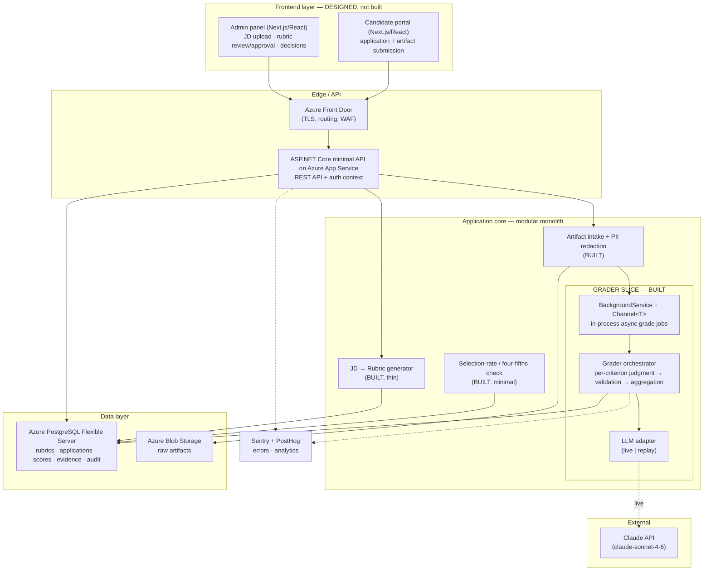

# PS2 — Startup Hiring System: System Design
**Work trial · Meraki Labs · Founding-engineer track**

> **What I built vs. what I designed.** This is a full-stack system. I designed the whole thing and built the **rubric grader** as the deep slice — the module where a wrong AI output directly harms a real person, and therefore where the anti-hallucination and auditability work has to be proven — plus a **thin JD→rubric generator** on top of it to demonstrate the end-to-end pipeline (`JD → draft → approve → grade → audit`). Everything else (frontend, hire-decision workflow) is designed here but deliberately not built. Scope was the test; the grader was the highest-value slice and the generator is deliberately thin — its low stakes come from the human-approval gate, so it doesn't need the grader's safeguards.

---

## 1. Problem & scope
North star: application → AI screen → rubric-based grading → decision, with an admin panel that uploads a JD and auto-generates the evaluation rubric.

The hard problem in this system is not the plumbing (intake, tracking, dashboards). It is producing a **defensible, auditable, non-hallucinated grade** of a candidate against role-specific criteria. That is the slice I built. The scope guardrail is respected: **no real biometric or video data is processed** — the video screen is stubbed as a structured transcript.

**Built — deep (grader):** artifact in → async grade → per-criterion constrained LLM judgment → boundary validation → deterministic weighted composite → persisted result + full audit trail. Multi-tenant isolation, abstention, and graceful-degradation paths are real and tested.

**Built — thin (generator):** JD in → one structured LLM call → draft weighted, anchored criteria → human approval → immutable versioned rubric the grader consumes. Weights normalised in code; the draft is auditable. Deliberately thin: no UI, no JD-parsing sophistication.

**Designed, not built:** the candidate/admin frontend, the human hire-decision UI, real authentication, and the full adverse-impact audit report (a minimal four-fifths computation *is* built, over seeded data, to prove the mechanism).

---

## 2. Requirements
**Functional**
- Admin uploads a JD; system generates a weighted, human-approvable rubric. *(built, thin)*
- Human approves a rubric; it becomes an immutable, versioned input. *(built; approval endpoint freezes the draft into the version the grader consumes)*
- Candidate artifact (stubbed transcript) is intake-d and graded against the approved rubric. *(built)*
- Each criterion gets a score with **verbatim cited evidence** from the artifact. *(built)*
- Composite score + recommendation produced; application moves through states. *(built)*
- Full audit trail is queryable per application. *(built)*

**Non-functional — auditability and fairness are first-class here, not afterthoughts**
- **Auditability:** every score traces score → cited evidence → criterion → exact approved rubric version. No black-box scores.
- **Fairness:** no scoring on proxies for protected attributes; PII/name-blind before the model sees the artifact; selection-rate monitoring across groups.
- **Correctness under uncertainty:** the system never silently invents a grade — it abstains or routes to a human.
- **Multi-tenancy:** many startups under one studio share the platform with hard data isolation.
- **Right-sized scale:** low QPS, high stakes *per decision*. Optimize for correctness, reproducibility, and audit — not throughput.

The three paths, separated deliberately:
- **Write/ingest path** — JD→rubric (thin, built) and artifact intake. Async, human-reviewed.
- **Grading path** — the deterministic-aggregation-over-constrained-LLM core. The slice.
- **Read path** — ATS dashboard / result + audit queries. Cache-friendly.

---

## 3. Full-stack architecture
The system is full-stack. I name every layer so the design is honest about the whole; the dashed box marks the one slice built in code.



**Why a modular monolith, not microservices.** One slice does not earn a six-service architecture — the assignment names that as a red flag, and I agree. The grader, intake, and (thin) rubric generator are modules (folders/namespaces inside one ASP.NET Core deployable) behind clean interfaces. If a module needs independent scaling later (the grader is the obvious first candidate, because LLM calls dominate cost), the namespace boundaries are already where I'd split. Right-sized now, splittable later.

**Why minimal API, not MVC controllers.** The endpoint surface is tiny and fixed (intake, grade, two reads, approve, fairness). Minimal APIs express that directly with no controller/attribute-routing boilerplate, which keeps the slice small and easy to read end-to-end — the same right-sizing logic as choosing a monolith over services. Controllers would earn their structure only with a larger, conventionally-grouped surface.

**Why .NET, and why not Python.** C#/.NET is my production backend language (Azure data pipelines at Microsoft; CashDesk's application layer). Python in my architecture is reserved for the ML sidecar — and **this slice has no ML**; it is backend orchestration. I started in Python by reflex, caught the mismatch, and switched (see `ai/decisions/0002-switch-to-csharp.md`). Trade-off acknowledged: studios often lean Python for AI work, but defensibility under hard questioning — explaining a slice line-by-line in my strongest language — outweighs that stylistic signal.

**Cloud note.** Named in Azure because that is my production environment (App Service + PostgreSQL Flexible Server + Blob). The design is cloud-portable — every component maps 1:1 to AWS/GCP equivalents; nothing here is Azure-locked.

---

## 4. Estimation — right-sized on purpose
Hiring is **low-QPS, high-stakes-per-decision**. Across multiple tenant startups, realistic volume is thousands of applications/day, not millions of requests/sec. The implication drives the whole design: I optimize for **correctness, reproducibility, and auditability**, not throughput.

The real cost driver is **not infrastructure — it is LLM tokens per grade.** A grade is N criteria × one structured call each (or batched). That is what I cache (by artifact + rubric-version signature) and batch, and why model choice (Sonnet over Opus) is a deliberate cost lever. Naming token cost as the bottleneck — rather than pretending this is a QPS problem — is the honest read.

---

## 5. API design
```
POST /jd                          → generate draft rubric            (built, thin)
POST /rubrics/{id}/approve        → freeze rubric as immutable version (built, thin)
POST /applications                → intake artifact (→ Blob, redact)  (built)
POST /applications/{id}/grade     → enqueue async grade               (built)
GET  /applications/{id}           → state, composite, per-criterion scores (built)
GET  /applications/{id}/audit     → full trace: evidence→criterion→rubric version (built)
GET  /fairness/selection-rates    → selection rate by group + four-fifths flag (built, minimal)
```
The dedicated `/audit` endpoint exists because auditability is a feature, not a log. The grade endpoint returns immediately with a job handle; the result is polled — grading is async so a slow LLM call never blocks the request path.

---

## 6. Data model + storage choice
**PostgreSQL, and why:** this is auditable decision data about real people. I need transactional integrity and foreign keys tying `score → evidence → criterion → rubric_version`, plus queryable history. NoSQL buys nothing here and loses exactly the relational integrity that auditability depends on. Raw artifacts go to **Blob** (large, write-once, referenced by pointer) — not into Postgres rows.

Core tables:

| Table | Key fields | Purpose |
|---|---|---|
| `tenant` | id | isolation boundary |
| `rubric` / `rubric_version` | id, tenant_id, version, approved_by, approved_at | immutable, versioned scoring guide |
| `rubric_criterion` | rubric_version_id, name, weight, anchors(1–5) | weighted criteria with behavioral anchors |
| `application` | id, tenant_id, state | the candidate's record + state machine |
| `artifact` | application_id, blob_uri, redacted_blob_uri | raw + PII-redacted transcript pointers |
| `grade` | application_id, rubric_version_id, composite, status | one grading run, pinned to a rubric version |
| `criterion_score` | grade_id, criterion, score, evidence_turn_id, evidence_text, confidence | **evidence is a first-class row**, not a comment |
| `audit_event` | application_id, type, payload, ts | append-only decision trail |

Evidence living in the data model as queryable rows — with the turn it came from — is what makes "every score is traceable" a true statement rather than a slogan.

---

## 7. Deep dive — the grader (where Senior is won)
This is the slice. The honest architectural claim, stated precisely:

> Grading free-text inherently requires judgment — there is no deterministic function that scores a transcript, so I do **not** claim "the LLM never produces the grade." Instead: the LLM's per-criterion judgment is **constrained, evidence-cited, validated, and abstainable**, and the **composite score is deterministic weighted aggregation in code** — so no grade is ever unexplainable, and the number is reproducible even though the judgment isn't.

Recognizing that this differs from a fully-deterministic forecast pipeline — and saying so — is the point. I don't overclaim the architecture; I claim exactly what it does.

The flow, with the safeguard visible at each step:
1. **Approved rubric in.** Human-approved, versioned, immutable. Human-in-the-loop on the *rubric*, before any candidate is touched.
2. **PII/name-blind redaction** of the artifact before it reaches the model — cheap, and directly anti-bias.
3. **Per-criterion constrained call.** For each criterion the model gets *only* that criterion's definition + the redacted transcript, and must return **structured output**: a 1–5 score, a **verbatim evidence span + turn_id**, and a confidence. Grounded — it judges only what's in front of it, criterion by criterion.
4. **Validation at the boundary.** The cited evidence span is normalized (whitespace, quotes, casefold) and matched as an exact substring *within the cited turn*. **If the cited evidence is not actually in the artifact, that is a caught hallucination → reject and flag, never score.** No fuzzy/semantic match: fuzzy matching would let the model paraphrase its evidence and still pass, which defeats the entire check. Strictness *is* the safeguard.
5. **Abstention + uncertainty routing.** The model may return "insufficient evidence." Low-confidence criteria are routed to `needs_human_grading` on the same path. Confidence is a **triage signal, not a calibrated correctness measure** — LLM self-reported confidence is not reliable, so its only job is sending the obviously-uncertain to a human. The system never silently decides under uncertainty.
6. **Deterministic aggregation.** Composite = weighted sum of per-criterion scores, computed in code. The LLM never computes the composite.
7. **Graceful degradation.** LLM down or unparseable → the application goes to `needs_human_grading`, never a fabricated score.

States: `queued → graded | needs_human_grading | failed`.

---

## 8. The crux — fairness & auditability
The assignment names this the strong senior signal, so it is addressed head-on rather than gestured at.

**Auditability** is already solved by the architecture above: every composite decomposes to per-criterion scores, each pinned to verbatim evidence and to the exact approved rubric version. The `/audit` endpoint reconstructs the full chain. There are no scores that cannot be explained to a candidate, a hiring manager, or a regulator.

**Fairness**, layered:
- *Rubric legitimacy* — criteria are job-relevant and human-approved before use. Protected-attribute exclusion is enforced by **three layers, none of which is "the prompt prevents bias"** (a prompt cannot guarantee that): (1) the generation prompt *discourages* protected attributes and obvious proxies; (2) a lightweight **code-level denylist** scans generated criterion keys/labels for obvious protected-attribute terms (age, gender, race, religion, nationality, family/marital status, disability) and **flags them for the reviewer — it never silently drops a criterion**, because a substring denylist is a blunt signal, not a judge. Those flags are **persisted on the draft and resurfaced in the approval response** (`POST /rubrics/{id}/approve` returns them alongside the rubric), so the reviewer sees them *at the moment of approval* rather than the gate signing off blind; (3) the **human approval gate** is the actual enforcement point — a person signs off on every rubric before it grades anyone, with the flags from (2) in front of them, and that approval is itself audited (approver + timestamp + draft→approved transition). There is deliberately **no automated semantic proxy-detection** (e.g. "elite university" as a wealth proxy); that needs real judgement and is named in §11 as future work. The denylist turns one layer (the human gate) into three cheap, complementary signals — defence in depth, honestly bounded.
- *Blind grading* — PII/name redaction means the model never sees signals correlated with protected class.
- *Evidence-cited scores* — no black-box judgments; every score points at a quote.
- *Outcome monitoring* — selection rate per group with the **four-fifths (80%) rule** flag: if any group's selection rate falls below 80% of the highest group's, flag adverse impact for review. Built as a minimal computation over seeded synthetic data to prove the mechanism; in production it runs over real aggregate outcomes. This is the backstop that catches what the upstream layers miss: even a clean-looking rubric can produce disparate outcomes, so exclusion is *monitored downstream*, not assumed upstream.

**Regulatory framing** — NYC Local Law 144 (bias audits for automated employment decision tools) and the EU AI Act (employment screening as a high-risk use) are the relevant regimes; the design supports their core demands (independent bias auditing, candidate transparency, traceable decisions). *⚠️ Verify the current specifics (audit cadence, publication requirements, high-risk timelines) before the live presentation — these evolve, and I should not state stale dates with confidence.*

---

## 9. What scales, what breaks
- **LLM cost & latency** (the real bottleneck) — batch criteria into fewer calls; cache by artifact + rubric-version signature; cheaper model tier for easy criteria; Sonnet over Opus as the default cost lever.
- **Hallucinated evidence** — caught deterministically by the existence check (§7.4). This is the safeguard I'm proudest of: it makes hallucinated grades *detectable*, not merely discouraged.
- **Silent bias** (the dangerous failure) — a rubric or model systematically scoring one group lower. Loud failures (a crashed job) are easy; this one is invisible without the §8 monitoring. That's why outcome monitoring is built, not just documented.
- **Tenant data leakage** — every query scoped by `tenant_id`, enforced in the **repository layer in one place**, so isolation can't be forgotten at a call site. Identity is stubbed; the *enforcement* is real and tested.
- **Worker queue backpressure** at scale — the in-process `Channel<T>` is bounded; watch its depth. At real volume this is the first thing to swap for a durable broker (and to move the worker to its own scaled tier) — flagged as a deliberate, deferred decision, not a silent default.

---

## 10. Scoping — what I deliberately did not build, and why
- **Frontend** — designed (§3), not built. The hard correctness problem is entirely backend; the UI is straightforward CRUD over these APIs. A frontend would have been the low-signal slice.
- **JD→rubric generator** — built, but deliberately **thin**. Its output is human-approved before use, so its mistakes are caught by that gate — lower stakes than a grade that drives a decision. That is *why* it's thin: one structured call, weights normalised in code, no JD-parsing sophistication, no UI. It exists to make the end-to-end pipeline real; the depth budget went to the grader, where a wrong output actually harms someone.
- **Real auth** — stubbed via an authenticated-context dependency (header/token → tenant), so repo-layer tenant enforcement is real and testable even though identity isn't.
- **Full adverse-impact audit report** — only the minimal four-fifths computation is built; the full report needs real aggregate population data a demo doesn't have.

---

## 11. With two more weeks / at 100k users
- Deepen the JD→rubric generator: JD section parsing, proxy-attribute linting of generated criteria, iterative human-in-the-loop refinement (the thin version already does structured output + approval gate + versioning).
- Build the admin + candidate frontends; wire the human approval/decision workflow.
- Promote the grader to an independently-scaled worker tier; add the explanation-cache and criterion-batching cost optimizations.
- Real auth + RBAC; per-tenant data-isolation tests in CI.
- Full bias-audit reporting pipeline over real outcomes; calibration tracking on confidence; drift monitoring on grade distributions per role over time.
- Human-in-the-loop review queue UI for `needs_human_grading`.

---
*Built slice runs from a clean README with zero credentials (replay-fixture LLM backend); live Claude is opt-in via env var.*
